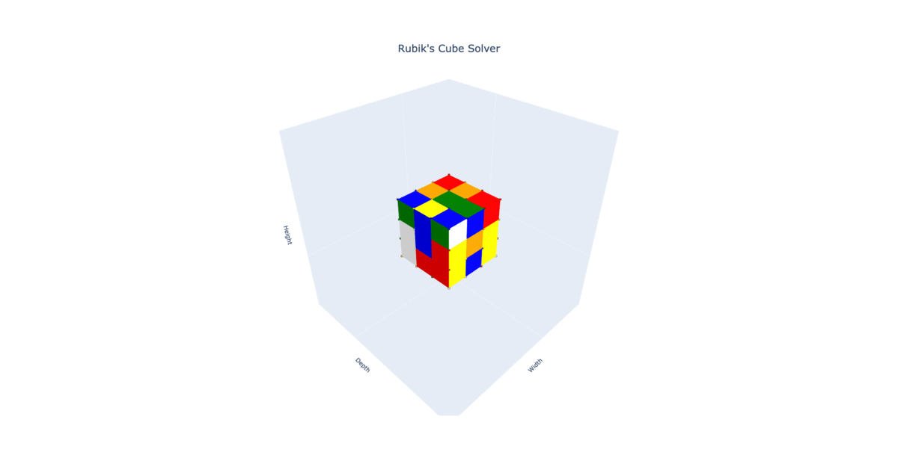

# rubiks-cube
Python-based code for visualizing, solving and animating a Rubik's cube in 3D. This repository can be used for solving Rubik's cubes, experimenting with Rubik's cube solving strategies, animating Rubik's cube solutions with Plotly, and learning how to solve a Rubik's cube in an RL environment. An OpenAI gym [environment](https://gym.openai.com/envs/) for the Rubik's Cube is included, which allows for tensorflow and OpenAI RL algorithms to be applied.

